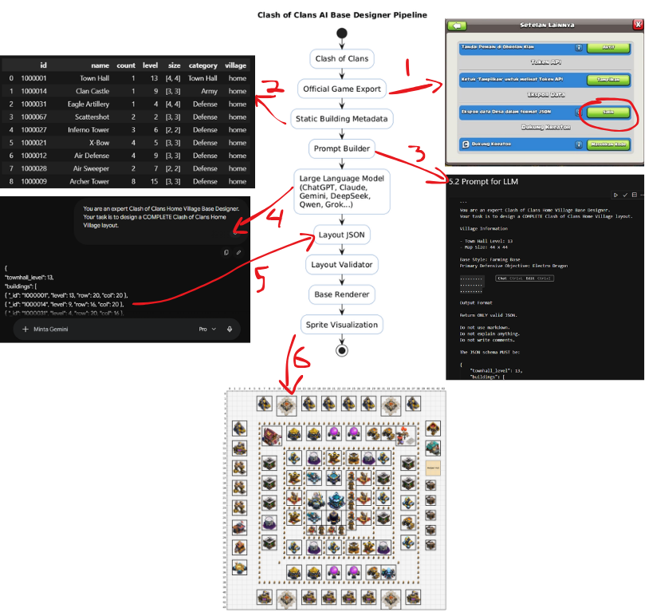

# Clash of Clans AI Base Designer

> AI-assisted Clash of Clans Home Village Base Designer powered by Large Language Models (LLMs) and future custom AI models.


---
## Sample AI-Generated Layouts

The following examples were generated using the same design prompt with different Large Language Models. Each model returns a JSON layout, which is then rendered by the project's visualization engine.

### Gemini Pro


### Claude Haiku 4.5


### DeepSeek


### Grok Fast


### Qwen 3.7 Plus Thinking


> **Note**
>
> These layouts are generated by different AI models using the same prompt and building metadata. They are intended to demonstrate the current capabilities of the AI layout generation pipeline.

---

## Overview

Clash of Clans AI Base Designer is a research project that aims to automatically generate Home Village layouts using Artificial Intelligence.

Unlike traditional base editors, this project represents every building as structured metadata and converts AI-generated layouts into valid Clash of Clans base designs.

The current version uses Large Language Models (LLMs) such as ChatGPT, Claude, Gemini, and DeepSeek to generate layouts in JSON format.

Future versions will replace external LLMs with an internally trained AI model capable of designing optimal bases based on strategic objectives.

---
The following diagram illustrates the complete workflow of the AI-assisted Clash of Clans Base Designer.



### Workflow

1. **Export Village Data**
   - Export your Clash of Clans village using the official in-game **JSON Export** feature.
   - The exported file contains all building information, including IDs, levels, and quantities.

2. **Generate Building Metadata**
   - The exported JSON is parsed and mapped to `static_data.json`.
   - Each building is associated with its metadata, such as:
     - Official building ID
     - Building name
     - Size
     - Category
     - Level
     - Village type

3. **Generate Layout with an LLM**
   - The metadata is used to build a structured prompt.
   - The prompt is sent to a Large Language Model (e.g., ChatGPT, Claude, Gemini, DeepSeek, Grok, or Qwen).
   - The AI generates a complete Clash of Clans base layout in JSON format.

4. **Receive Layout JSON**
   - The generated layout contains the coordinates (`row`, `col`) for every building and wall.
   - This JSON serves as a standardized layout representation independent of the AI model.

5. **Validate the Layout**
   - The generated layout is validated to ensure:
     - No overlapping buildings
     - Correct number of buildings
     - Valid map boundaries
     - Valid wall placements

6. **Render the Base**
   - The validated layout is rendered into a visual Clash of Clans base using building sprites.
   - This visualization allows users to inspect and compare layouts generated by different AI models.

> **Note**
>
> The current version focuses on AI-assisted layout generation and visualization. Future versions aim to replace external LLMs with an internally trained AI model capable of generating optimized Clash of Clans layouts without relying on third-party services.
---

## Features

### Current Features

- Export official Clash of Clans building metadata
- Building mapping using official `_id`
- Static building database (`static_data.json`)
- Automatic prompt generation for LLMs
- AI-generated base layouts
- JSON-based layout representation
- Sprite-based renderer
- Colored renderer
- Wall rendering
- Building visualization
- Level-aware building sprites
- Support for Town Hall sprites
- Easy extension for additional building sprites


---

## Project Architecture

```
                 Clash of Clans
                       │
                       ▼
             Official Game Export
                       │
                       ▼
            Static Building Metadata
                       │
                       ▼
                 Prompt Builder
                       │
                       ▼
             Large Language Model
      (GPT, Claude, Gemini, DeepSeek...)
                       │
                       ▼
                 Layout JSON
                       │
                       ▼
               Layout Validator
                       │
                       ▼
                 Base Renderer
                       │
                       ▼
              Sprite Visualization
```

---

## JSON Layout Format

Example:

```json
{
    "townhall_level": 13,
    "buildings": [
        {
            "_id": "1000001",
            "level": 13,
            "row": 20,
            "col": 20
        }
    ],
    "walls": [
        {
            "row": 18,
            "col": 19
        }
    ]
}
```

---

## Current Workflow

1. Export Clash of Clans metadata.
2. Map every building using its official `_id`.
3. Generate prompts.
4. Send prompts to an LLM.
5. Receive layout in JSON.
6. Validate generated layout.
7. Render buildings using sprites.
8. Export the final base image.

---

## Supported LLMs

Current experiments include:

- ChatGPT
- Claude
- Gemini
- DeepSeek

Future comparisons may include:

- Grok
- Qwen
- Mistral
- Llama
- Kimi

---

## Motivation

This project explores the integration of Artificial Intelligence with game strategy and procedural layout generation.

The long-term goal is to create a fully autonomous AI capable of designing competitive Clash of Clans bases based on customizable objectives.

---

## Game Assets

This repository does not include Clash of Clans game assets.

The renderer is designed to work with user-provided assets located in:

assets/buildings/

This project only contains the source code and metadata required to render layouts.

---

## License

MIT License

---

## Author

**Widi Arrohman**

Master Student in Informatics Engineering

mail: arrohmanwidi@gmail.com

Research Interests:

- Artificial Intelligence
- Computer Vision
- Deep Learning
